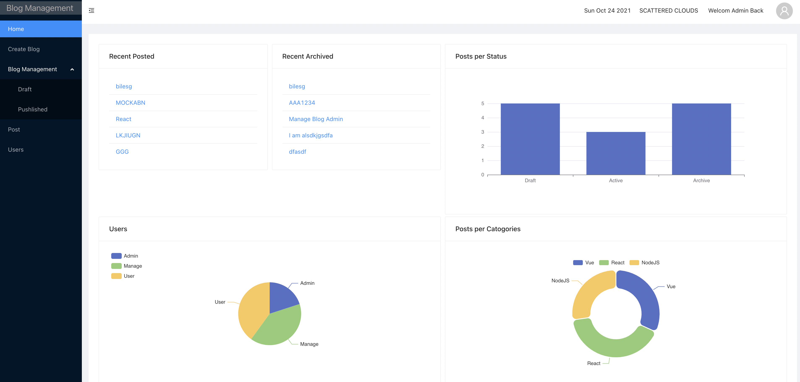
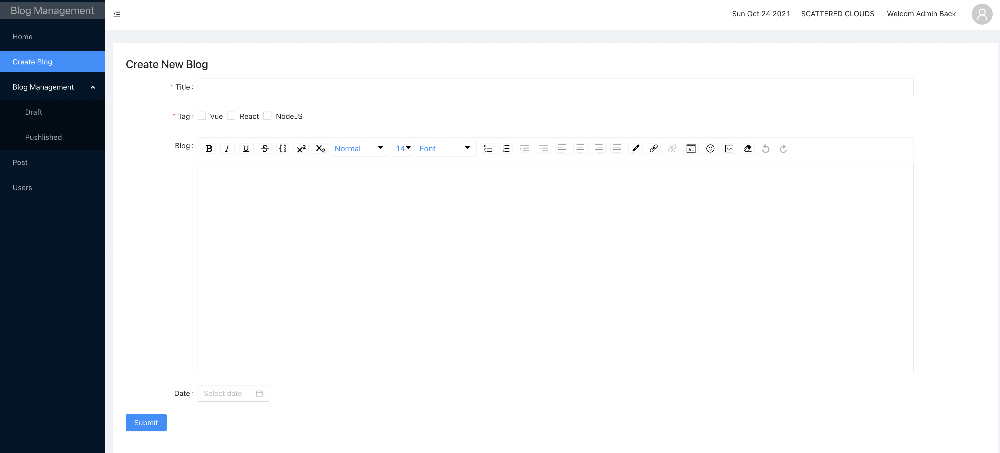
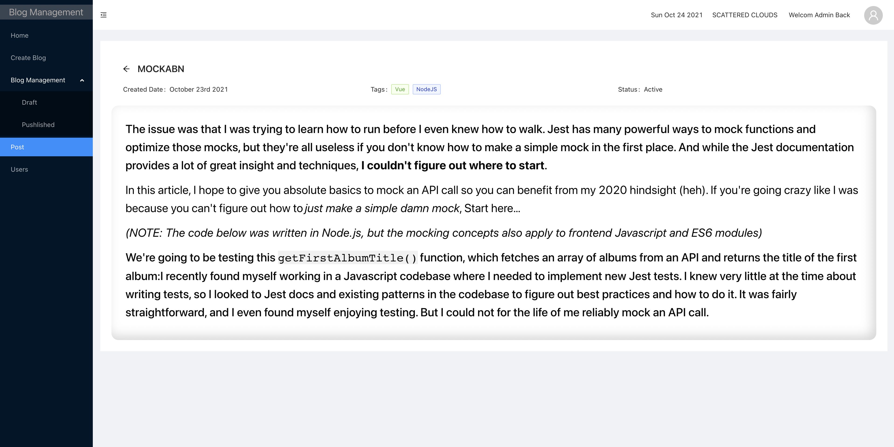
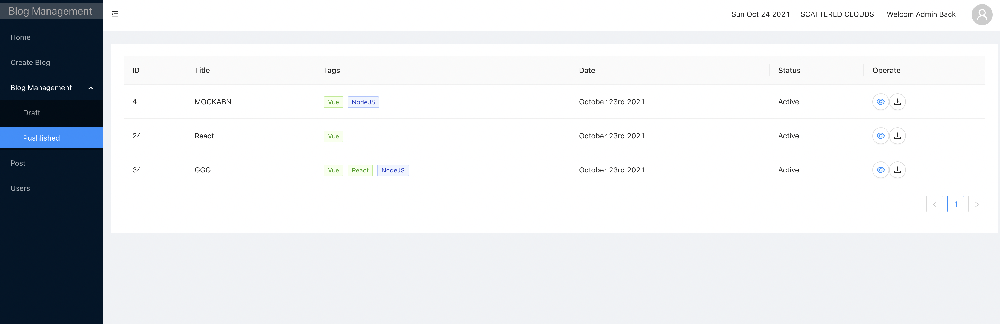

# Getting Started

It is using React Hooks/Redux version,MongoDB/Express. For json-server, it is available on branch dev.

## Available Scripts

In the project directory, you can run:

### `npm install`
You will need install all dependencies

### `yarn start`

Runs the app in the development mode.
Open [http://localhost:3001](http://localhost:3001) to view it in the browser.

The page will reload if you make edits.
You will also see any lint errors in the console.

### `$cd server $node server.js`
It is based on mongoDB and express

## Function

### Home Page
It is an overall of project --- Echarts.

### Create Blog
It is supported RT.

### Preview Blog
It is supported RT.

### Catogory
We got draft/active/archived status for blogs. You can do CRUD on this page.

